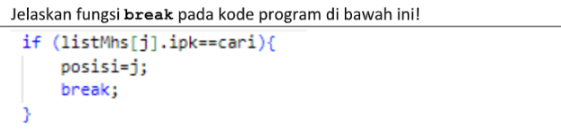

# JOBSHEET-7
## Pertnayaan 6.2.3
1. Jelaskan perbedaan metod tampilDataSearch dan tampilPosisi pada class
MahasiswaBerprestasi!
2. 
3. Apa fungsi variabel pos atau indeks hasil pencarian dalam program sequential search?
4. Jika terdapat lebih dari satu data dengan nilai yang sama, hasil pencarian sequential search yang
dibuat di atas akan menampilkan data ke berapa? Jelaskan.
5. Berkaitan dengan pertanyaan nomor 2 di atas, apa yang terjadi jika perintah `break` dihapus dari kode di atas?

## Jawaban
1. - tampilDataSearch: Berfungsi untuk mencetak rincian seluruh atribut data mahasiswa secara lengkap (seperti NIM, Nama, Kelas, dan IPK) pada indeks hasil pencarian tersebut.
- tampilPosisi: Hanya berfungsi untuk mencetak kalimat informasi yang menunjukkan di indeks (posisi) ke berapa data IPK tersebut ditemukan di dalam array.
2. Fungsi break digunakan untuk menghentikan proses perulangan (for) secara paksa saat itu juga. Begitu data IPK yang dicari cocok (ipk == cari), program akan mencatat posisinya dan langsung keluar dari perulangan agar tidak membuang waktu memeriksa sisa data lainnya.
3. Fungsi variabel `pos` atau indeks hasil pencarian Variabel `pos` berfungsi sebagai tempat penampung (variabel penyimpan), letak indeks array di mana data yang dicari berada. Biasanya diinisialisasi dengan nilai `-1` sebagai penanda awal bahwa data belum atau tidak ditemukan.
4. Data pertama, karena adanya perintah `break` di dalam blok pengecekan. Begitu sistem menemukan kecocokan pertama, perulangan langsung dihentikan dan sistem tidak akan mengecek apakah ada IPK yang sama
5. Program akan menjadi kurang efisien karena terus melakukan pencarian sampai elemen terakhir array, meskipun datanya sudah ketemu di awal. Akibatnya, hasil pencarian justru akan menampilkan data terakhir (indeks terbesar) yang cocok.

## Pertnayaan 6.3.3
1. Tunjukkan pada kode program yang mana proses divide dijalankan!
2. Tunjukkan pada kode program yang mana proses conquer dijalankan!
3. Apa fungsi `left, right, dan mid`?
4. Jika data IPK yang dimasukkan tidak urut. Apakah program masih dapat berjalan? Mengapa
demikian?
5. Jika IPK yang dimasukkan dari IPK terbesar ke terkecil (misal: 3.8, 3.7, 3.5, 3.4, 3.2) dan elemen yang dicari adalah 3.2. Bagaimana hasil dari binary search? Apakah sesuai? Jika tidak sesuai maka ubahlah kode program binary seach agar hasilnya sesuai
6. Jelaskan bagaimana binary search menentukan bahwa data yang dicari tidak ditemukan di dalam array.
7. Modifikasi program di atas yang mana jumlah mahasiswa yang diinputkan sesuai dengan
masukan dari keyboard.

## Jawaban
1. Proses divide (pembagian area pencarian) dijalankan pada baris penentuan nilai tengah, yaitu: `mid = (left + right) / 2;`
2. Proses Concuer dijalankan pada baris pemanggilan fungsi secara rekursif, yaitu:
`return findBinarySearch(cari, left, mid - 1);` dan `return findBinarySearch(cari, mid + 1, right);`
3. - left: Menyimpan nilai indeks batas bawah (paling kiri) dari area array yang sedang dicari.
- right: Menyimpan nilai indeks batas atas (paling kanan) dari area array yang sedang dicari.
- mid: Menyimpan nilai indeks tengah dari area pencarian, yang digunakan sebagai titik pembanding utama dengan data yang dicari.
4. Masih dapat berjalan namun hasil perncariannya akan salah, karena Algoritma binary search sangat bergantung pada kondisi data yang terurut untuk menebak secara logis apakah data yang dicari berada di sebelah kiri atau kanan nilai tengah.
5. Hasilnya tidak sesuai.
``` java
else if (listMhs[mid].ipk < cari) { 
    return findBinarySearch(cari, left, mid - 1);
} else {
    return findBinarySearch(cari, mid + 1, right);
}
```
6. Binary search tidak ditemukannya data jika area pencarian sudah habis mengecil tanpa ada data yang cocok. Ini terjadi ketika nilai `left` sudah melebihi nilai `right` `(kondisi right >= left bernilai false)`. Jika kondisi ini terjadi, program akan keluar dari blok `if` dan mengeksekusi `return -1;`.
7. 
``` java
System.out.print("Masukkan jumlah mahasiswa: ");
int jumMhs = sc.nextInt();

// Array diinstansiasi dengan ukuran dari input keyboard
MahasiswaBerprestasi05 list = new MahasiswaBerprestasi05(jumMhs);
```